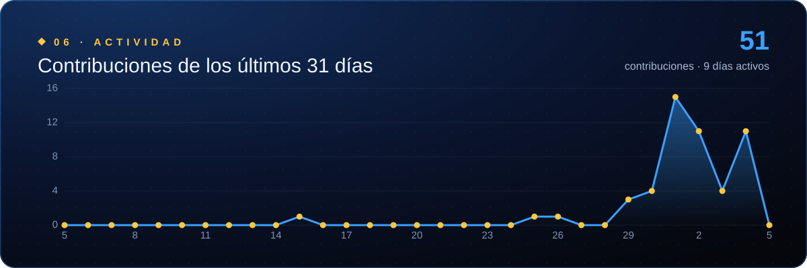

<p align="center">
  
</p>

<p align="center">
  <a href="https://github.com/PassBri">
    
  </a>
</p>

<p align="center">
  <a href="https://lordtraining.com"></a>
  <a href="https://passbri.github.io/romus/"></a>
  
</p>

---

### ◈ Sobre mí

```js
const brian = {
  rol:         ["Docente de Educación Física", "Investigador", "Desarrollador", "Artista plástico"],
  aula:        "22 años en la educación pública colombiana",
  formacion:   ["Licenciatura en Educación Física"],
  aprendiendo: "Tecnólogo en Análisis y Desarrollo de Software · SENA",
  ubicacion:   "Santander, Colombia 🇨🇴"
};
```

Soy docente de aula. Pienso como investigador y construyo como desarrollador. Me interesa lo que pasa cuando se cruzan la **pedagogía**, las **ciencias del deporte** y la **inteligencia artificial**.

---

### ◈ Proyectos

<table>
  <tr>
    <td width="50%" valign="top">
      <h4>◉ Romus</h4>
      <p>Asistente de voz con IA para Microsoft Word. Dices <b>«Ok Romus»</b> y lee, corrige, resume, redacta y da formato a tus documentos. Funciona con Claude, GPT, Gemini o una IA local. Su identidad es una esfera holográfica de partículas con núcleo dorado.</p>
      <p><a href="https://github.com/PassBri/romus"><b>Repositorio →</b></a> · <a href="https://passbri.github.io/romus/">Instalar</a></p>
      <p>  </p>
    </td>
    <td width="50%" valign="top">
      <h4>◉ LordTraining</h4>
      <p>Plataforma SaaS de periodización deportiva basada en mi modelo <b>PDI</b>. Ofrece cinco metodologías de periodización, control de carga ACWR, gestión de deportistas en más de 30 deportes y un módulo de scouting.</p>
      <p><a href="https://lordtraining.com"><b>lordtraining.com →</b></a></p>
      <p>  </p>
    </td>
  </tr>
  <tr>
    <td width="50%" valign="top">
      <h4>◉ EggChecker</h4>
      <p>Plataforma de gestión avícola desarrollada en equipo en el SENA (ADSO), con backend en Python/FastAPI y app Android en Kotlin/Jetpack Compose. Estoy a cargo de la documentación de ingeniería de software (ISO/IEC/IEEE 12207, 29148, IEEE 1016 e ISO 25010).</p>
      <p><a href="https://github.com/miguejpaezb/eggchecker"><b>Repositorio →</b></a> · <a href="https://eggchecker.click">eggchecker.click</a></p>
      <p>  </p>
    </td>
    <td width="50%" valign="top">
      <h4>◉ Obra académica</h4>
      <p><b>Periodización Dual Integrada (PDI):</b> modelo original de planificación del entrenamiento.<br>
      <b><i>Propositivismo Episistémico</i>:</b> libro de filosofía de la educación.<br>
      <b><i>QOÁNIMA</i>:</b> novela de ciencia ficción en proceso, parte de la <i>Serie de la teoría del viaje transformativo</i>.</p>
      <p>  </p>
    </td>
  </tr>
</table>

---

### ◈ Herramientas

<p align="center">
  
</p>
<p align="center">
  
  
  
  
  
</p>

---

### ◈ Más allá del código

**Arte.** Pinto desde niño, formado por mi padre. Trabajo óleo sobre lienzo con conceptos abstractos y he expuesto en el Museo de Arte Moderno de Bucaramanga. Mi serie de **frailejones** habla del páramo y de la violencia extractiva.

**Territorio.** Defiendo los páramos de Santander y participo en el debate público sobre la educación en Colombia.

---

### ◈ Actividad

<p align="center">
  
</p>

<p align="center">
  
</p>
